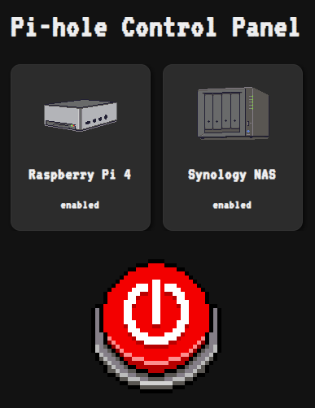

# Pi-hole Control Panel

[](https://github.com/anthonymonforte/pihole-control-panel/actions/workflows/pylint.yml?query=branch%3Amain)


<p align="center">
  
</p>
<div style="display: flex; align-items: center;">
  <div style="flex: 3; padding-right: 1rem;">
    <p>
      <strong>A simple web UI to enable/disable blocking on one or more instances of Pi-hole (v6.x)</strong>
      <br>
      <br>
      <i>This project is not a part of the official Pi-hole project, but uses the api provided by the Pi-hole instance(s).</i>
      <br>
      <br>  
    </p>
    <div style="flex: 1; text-align: right;">
      
    </div>
  </div>
<br>

## Configuration

## config.py

Use `config.py.changeme` for reference.  You must have a `config.py` file in the root folder with one or more Pi-hole instances defined.

For each Pi-hole instance you may use your user/admin password as the API token or an App Password.  Create an App Password from the target Pi-hole's UI -> Web Interface / API -> App Password (_You must enable Expert mode_)

### .env

You must create a `.env` file which includes:
```
FLASK_SECRET_KEY=your secret key value
```

You can use python to generate a secret key value:
```bash
python3 -c "import secrets; print(secrets.token_hex(32))"
```

## Installation
You can create and run a Docker image with:
```bash
docker compose up -d --build
```

## License

- **Code**: GPLv3 — see [LICENSE](/LICENSES/LICENSE)
- **Images**: [CC BY-NC 4.0](https://creativecommons.org/licenses/by-nc/4.0/) — see [LICENSES/images.txt](LICENSES/images.txt)
