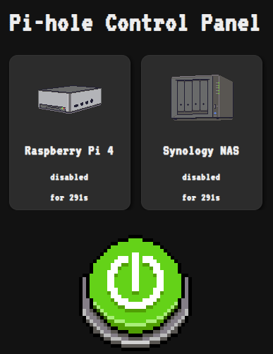

# Pi-hole Control Panel

[](https://github.com/anthonymonforte/pihole-control-panel/actions/workflows/pylint.yml?query=branch%3Amain)


<p align="center">
  
</p>
<div style="display: flex; align-items: center;">
  <div style="flex: 3; padding-right: 1rem;">
    <p>
      <strong>A simple web UI to enable/disable blocking on one or more instances of Pi-hole (v6.x)</strong>
      <br>
      <br>
      <i>This project is not a part of the official Pi-hole project, but uses the api provided by the Pi-hole instance(s).</i>
      <br>
      <br>
    </p>
    <div style="flex: 1; text-align: right;">      
                
              
    </div>
  </div>
<br>

## Configuration

## config.py

Use `config.py.changeme` for reference.  You must have a `config.py` file in the root folder with one or more Pi-hole instances defined.

For each Pi-hole instance you may use your user/admin password as the API token or an App Password.  Create an App Password from the target Pi-hole's UI -> Web Interface / API -> App Password (_You must enable Expert mode_)

| Name      | Default | Required | Example Value                                    | Description                                             |
|-----------|---------|----------|--------------------------------------------------|---------------------------------------------------------|
| `PIHOLE_INSTANCES` | `{}` | Yes | <i>See below</i> | Configuration for each Pi-hole instances.  Must have at least one entry. |
| `FLASK_SECRET_KEY` | n/a | Yes | `os.environ.get("FLASK_SECRET_KEY")` <br><i>if defined in .env file</i></br> | Secret key for Flask instance |
| `BLOCKING_DISABLE_DURATION` | `None` | No | `300` | Duration in seconds that blocking will revert to enabled after disabling.<br>If not defined then blocking is disabled indefinitely.</br> |
| `BLOCKING_ENABLE_DURATION` | `None` | No | `None` | Duration in seconds that blocking will revert to disabled after enabling.<br>If not defined then blocking is enabled indefinitely.</br> |

`PIHOLE_INSTANCES` Example:
```yaml
    "primary": {
        "domain": "pihole.yourdomain.net",
        "token": os.environ.get("PIHOLE_API_TOKEN"),
        "name": "Raspberry Pi 4",
        "location": "Office",
        "image": "/images/device/pi-case.png",
        "api_version": "v6"
    },
    "secondary": {
        "domain": "nas-pihole.yourdomain.net",
        "token": os.environ.get("NAS_API_TOKEN"),
        "name": "NAS",
        "location": "Server Room",
        "image": "/images/device/nas.png",
        "api_version": "v6"
    }
```

### .env

You must create a `.env` file which includes:
```
FLASK_SECRET_KEY=your secret key value
```

You can use python to generate a secret key value:
```bash
python3 -c "import secrets; print(secrets.token_hex(32))"
```

## Installation
You can create and run a Docker image with:
```bash
docker compose up -d --build
```

## Local Development

You can run it directly with:
```bash
flask run --host=0.0.0.0 --port=5000

```

Example Pylint commands:
```bash
pylint app.py services/ pihole/ utils/

pylint ./**/*.py --ignore=config.py --ignore-paths=venv
```

## License

- **Code**: GPLv3 — see [LICENSE](/LICENSES/LICENSE)
- **Images**: [CC BY-NC 4.0](https://creativecommons.org/licenses/by-nc/4.0/) — see [LICENSES/images.txt](LICENSES/images.txt)
